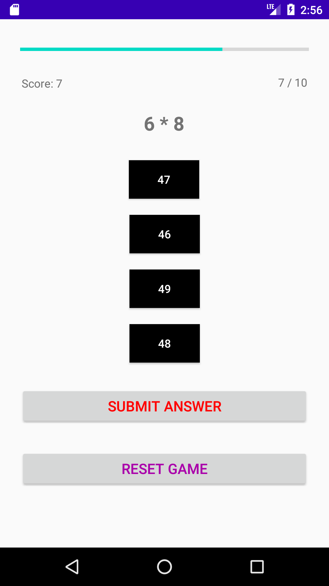

# Grundrechenarten Quiz

Fragen zu Addition, Subtraktion, Multiplikation und Division. Anzahl der Fragen und Schwierigkeitsgrad können zu Beginn festgelegt werden. Abschließend erfolgt eine Auswertung und Bewertung. 

   
   
   
   
  

